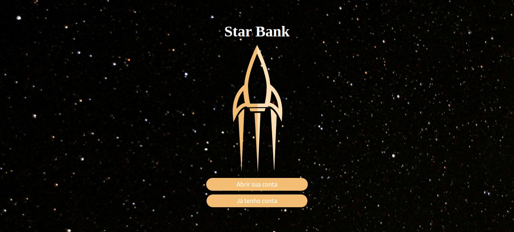
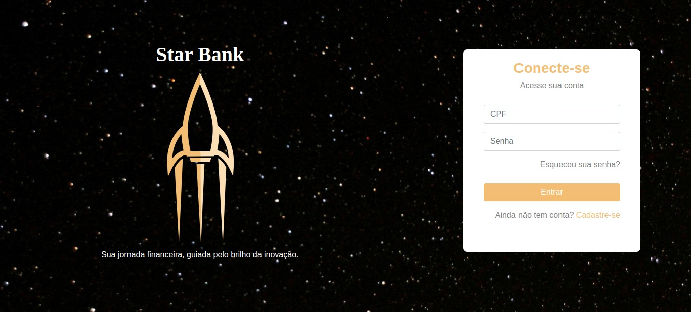
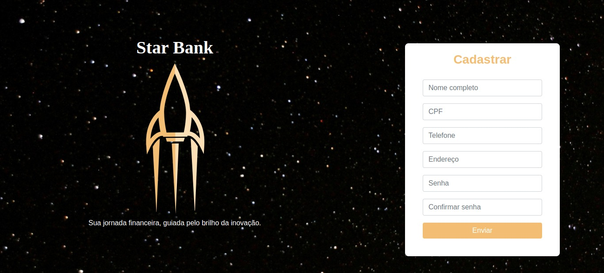
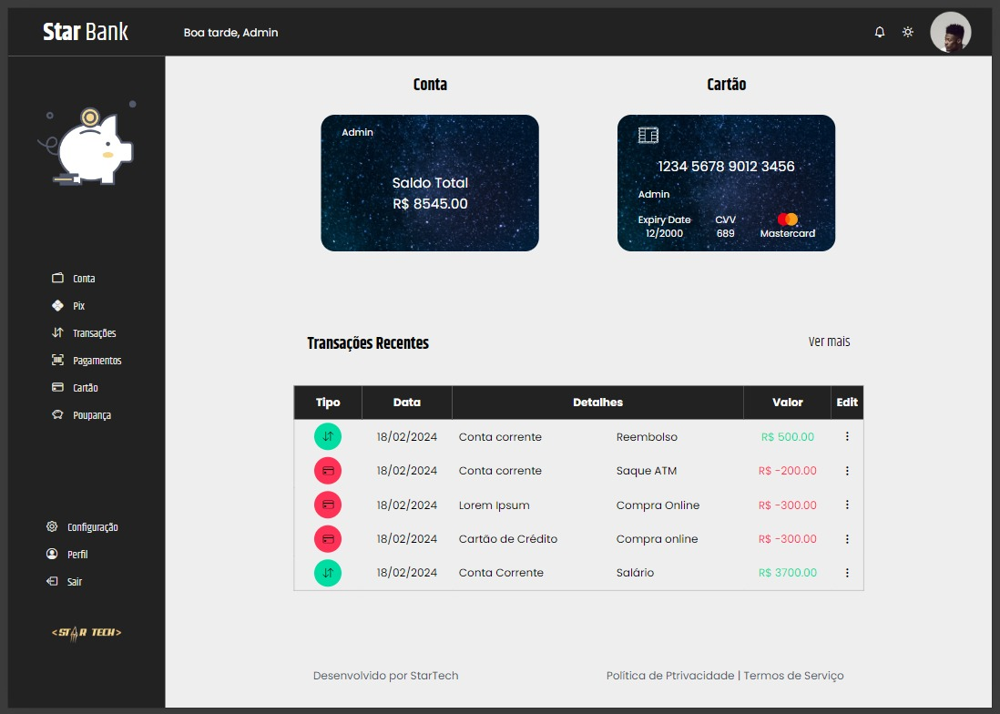

 

Star Bank Fintech Project | Sharp Coders 2023

Welcome to the project under development by the Star Tech team for Sharp Coders' HackaDev 2023. We are excited to introduce Star Bank, an innovative fintech in development aiming to redefine the financial experience.

## Index
- [Project features](#project-features)
- [Layout](#layout)
- [Demonstration](#demonstration)
- [Technologies Used](#technologies-used)
- [Star Tech Team](#star-tech-team)

## Project features 

-  Home
-  Login
-  User registration
-  Transaction history

## Layout

## Demonstration

[Link Deploy](colocarLinkDeploy)

## Technologies Used

- HTML
- CSS
- TypeScript
- Bootstrap
- Angular - version 17.1.3

## Star Tech Team

- Alexandre Belem
- Aline Vieira
- Brando Lee
- Lucas Padilha
- Marina Barbosa
- Moisés Oliveira
- Vitor Vogas
- Verônica Oliveira
- Wanderson Duarte